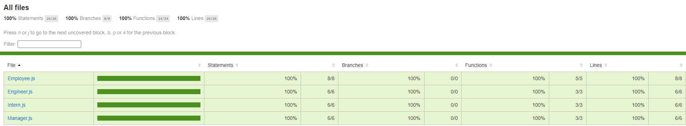

# Module 12 : Team Profile Generator

## Description

This week's challenge was to create an application that will take in information about employees on team, then generate an HTML webpage using Node.js, that displays quick information about each person such as email, github username, school and office number for the manager accessing the information.

## Installation 
  Clone the github repo and download node.js as well as the necessary version of inquirer and jest if you want conduct your own tests.

## Technologies Used

* Javascript
* ES6
* HTML
* Bootstrap
* Node.js
* Inquirer package
* Jest  

##  Usage

Open index.js in CLI and inquirer will prompt questions related to the team which will eventually be compiled into a HTML file that can be opened in the browser.

## Contributions
As always, as I am a complete novice in this field, any contributions to improve or correct the work would be highly appreciated. 

## Test
  
  Jest was used to test the code written. The tests themselves were pre-written.

## References
A lot of code was repurposed from the following websites: 
* https://stackoverflow.com/questions/201323/how-can-i-validate-an-email-address-using-a-regular-expression, 
* https://stackabuse.com/validate-email-addresses-with-regular-expressions-in-javascript/, 
* https://stackoverflow.com/questions/74854450/trying-to-goto-second-inquirer-prompt-depending-on-user-selection,
* https://www.digitalocean.com/community/tutorials/nodejs-interactive-command-line-prompts,
* https://jestjs.io/docs/asynchronous,
* https://javascript.info/

## License
Distributed under the MIT License. See LICENSE.txt for more information.
